---
# System Administration Report

---
## Part 1: Operating System Installation
The initial setup involved a successful installation of Ubuntu Server 20.04 LTS. The installation was performed without a graphical user interface.

*A screenshot of the terminal, confirming the command-line interface of the installed Ubuntu Server.*

---
## Part 2: User Account Management
A new user, `rosend`, was created using the `adduser` command. This user was subsequently added to the `adm` administrative group to grant necessary permissions using the command `sudo usermod -aG adm rosend`. The successful creation of the user was verified by checking the `/etc/passwd` file.

*Terminal output showing the successful creation of the new user `rosend` using the `adduser` command.*

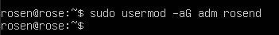

*Terminal output showing the command to add user `rosend` to the `adm` group.*

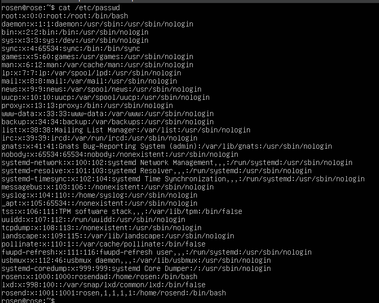

*Output of the `cat /etc/passwd` command, showing the entry for the newly created `rosend` user.*

---
## Part 3: Network Configuration
The server's network settings were configured as follows:

- **Hostname:** The system's hostname was updated. To see info about hostnames: `sudo nano /etc/hosts`.

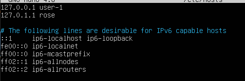

*Contents of the the configured hostname.*

*Terminal showing the `user-1`, verification.*

- **Timezone:** The timezone was set to `Europe/Moscow` using `sudo timedatectl set-timezone`

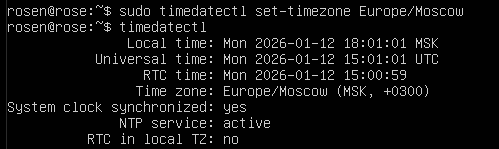

*Terminal output confirming the timezone has been set to `Europe/Moscow`.*

- **IP Configuration:** Initially, an IP address was dynamically acquired from a DHCP server. To list all network interfaces on system use `ip addr` or `ip link show command` or `ifconfig ens33` or `ifconfig ens33 | awk '/inet / {print $2}'`.

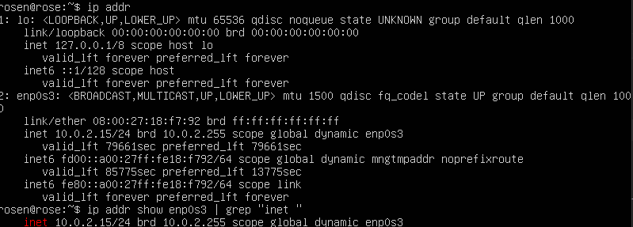

*Output of `ip addr show` or similar command, showing a dynamically assigned IP address on interface `ens33`.*

To see our route: `ip route show default`.

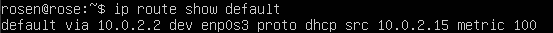

*Output of `ip route show default`, displaying the default gateway provided by DHCP.*

Subsequently, the system was configured with a static IP address, gateway, and DNS servers by modifying the appropriate Netplan `.yaml` configuration file. These changes were confirmed to persist after a system reboot. `sudo nano /etc/netplan/00-installer-config.yaml` was used.

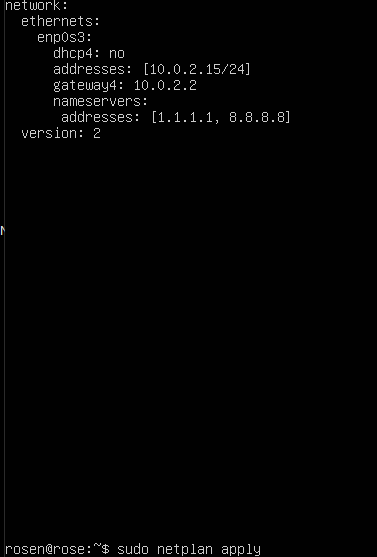

*Content of the Netplan YAML configuration file (`00-installer-config.yaml`) showing the static IP, gateway, and DNS settings.*

- **Connectivity Test:** Network connectivity was verified by successfully pinging both an IP address (`1.1.1.1`) and a domain name (`ya.ru`), confirming 0% packet loss.

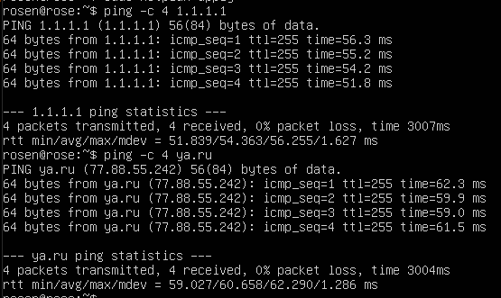

*Terminal output showing successful `ping` commands to `1.1.1.1` and `ya.ru` with 0% packet loss.*

---
## Part 4: System Updates
The system's software packages were brought up to date. This was accomplished by first refreshing the package repository list with `sudo apt update && sudo apt upgrade`.

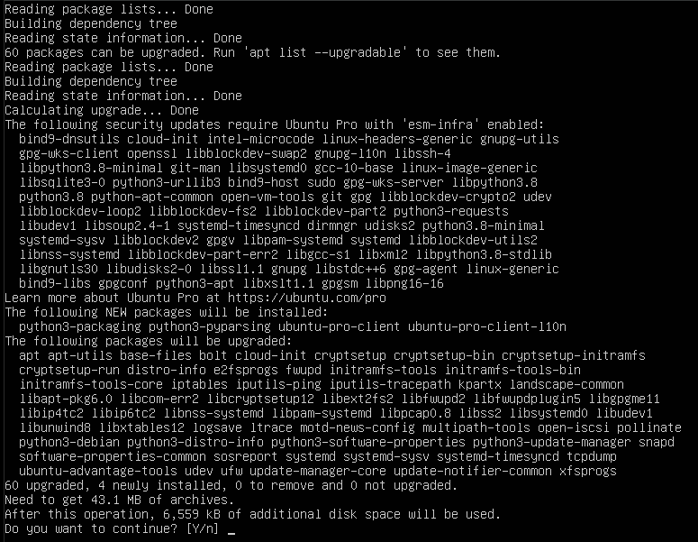

*Terminal output showing the successful completion of the `sudo apt update` command.*

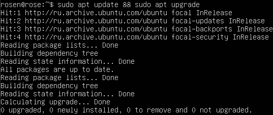

*Terminal output showing the successful completion of the `sudo apt upgrade` command.*

---
## Part 5: Privilege Escalation with `sudo`
The `sudo` command allows standard users to execute commands with elevated (root) privileges without logging in as the root user. The user `rosend` was granted `sudo` access. To demonstrate this capability, the user successfully changed the system hostname.

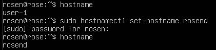

*Verification of the new hostname after the change made by user `rosend`.*

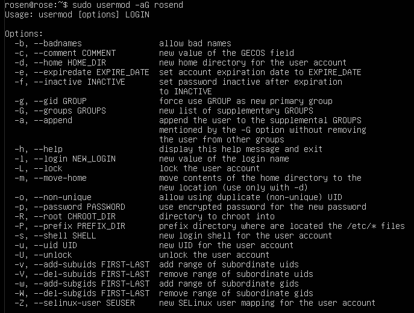

*User `rosend` using `sudo` to run the `hostnamectl set-hostname` command.*
---
## Part 6: Time Service Configuration
The system's time service was verified to be functioning correctly. The `timedatectl show` command was executed, and its output confirmed that NTP (Network Time Protocol) synchronization was active (`NTPSynchronized=yes`), ensuring accurate system time.

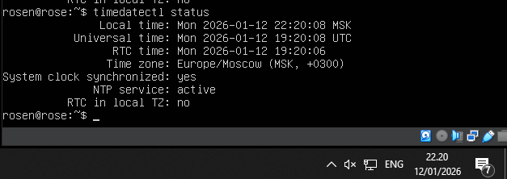

*Terminal shows `NTP service`, time is correct.*

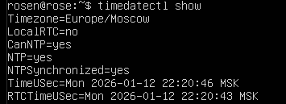

*Output of the `timedatectl show` command, highlighting the `NTPSynchronized=yes` line.*

---
## Part 7: Command-Line Text Editor Usage
Proficiency with several common text editors was demonstrated. The following actions were performed in NANO, VIM, and JOE:
- Saving changes and exiting the editor.
- Exiting the editor without saving changes.
- Searching for text within a file.
- Replacing text within a file.

### Nano
- **Save & Close**
  `Ctrl+S` → `Ctrl+X`

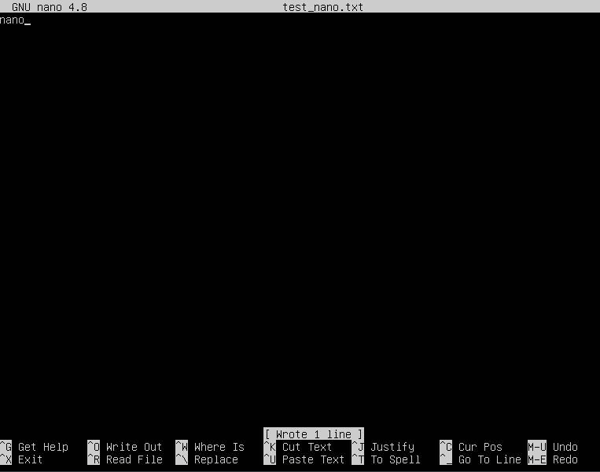

*The NANO editor interface with a text file open.*

- **Discard Changes**
  `Ctrl+X` → `N`

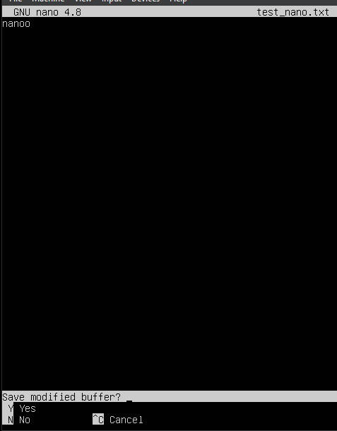

*NANO prompt asking to confirm discarding modified buffer.*

- **Word Search**
  `Ctrl+W` → `[term]` → `Enter`

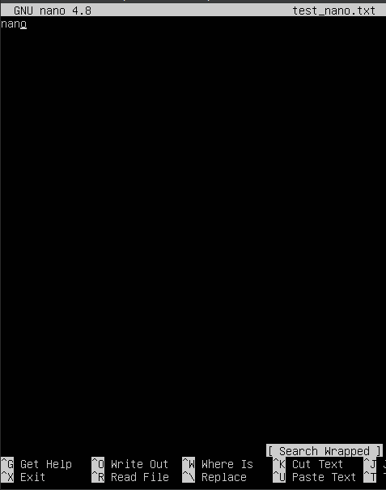

*NANO search prompt and result showing a single occurrence found.*

- **Word Replace**
  `Ctrl+\` → `[old]` → `[new]` → `A` (all)

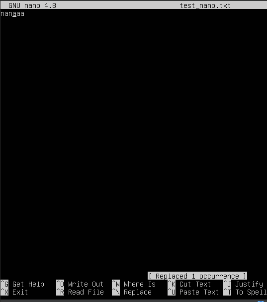

*NANO replace prompt and confirmation of a global replacement.*

### Vim
- **Save & Close**
  `:wq`

*Vim command line showing the `:wq` command to write and quit.*

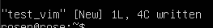

*Terminal after exiting Vim, confirming the file was saved.*

- **Discard Changes**
  `:q!`

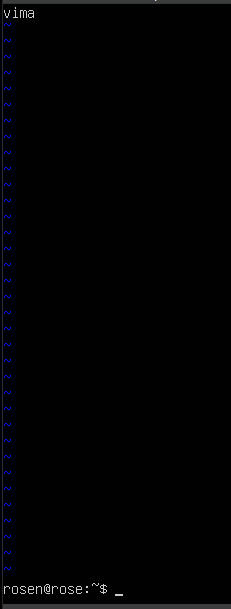

*Vim command line showing the `:q!` command to quit without saving.*

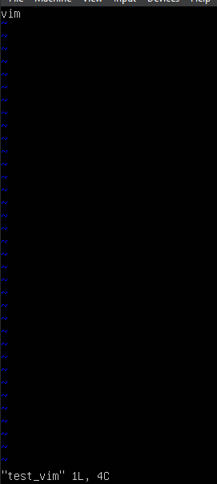

*Terminal after exiting Vim without saving changes.*

- **Word Search**
  `/<term>` → `Enter` → `n`/`N`

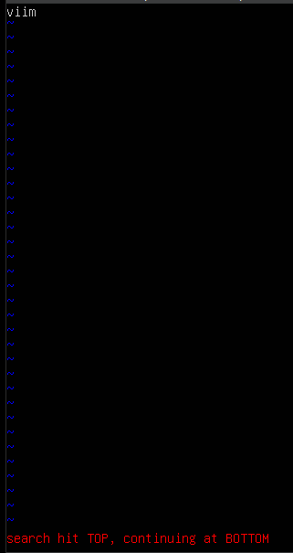

*Vim interface showing the use of `/` to search for a term.*

- **Word Replace**
  `:%s/old/new` for one, for every  with `/g`

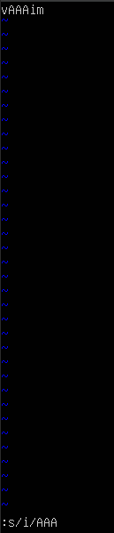

*Vim command line showing a global substitution (`:%s/old/new/g`) and its result.*

### Joe
- **Save & Close**
  `Ctrl+K` → `X`

*The JOE editor interface with the save and exit command sequence.*

- **Discard Changes**
  `Ctrl+C` → `Y`

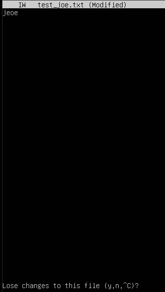

*JOE prompt asking to confirm aborting the current file.*

- **Word Search and Word Replace**
  `Ctrl+K` → `F` → `[term]` → `Enter`

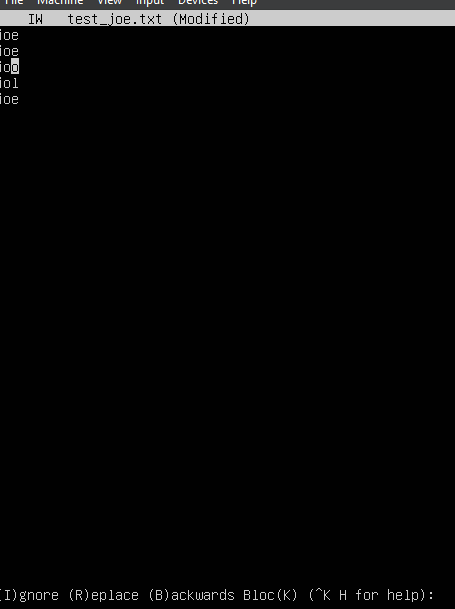

*JOE editor showing the find/replace dialog opened with `Ctrl+K F`.*

  `Ctrl+K` → `F` → `[old]` → `R` → `[new]` → `Y`

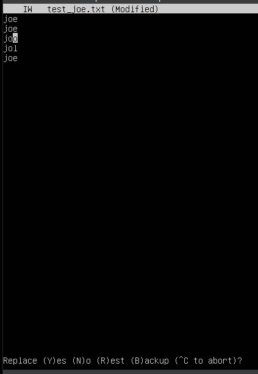

*JOE replace dialog prompting to replace an old string with a new one.*

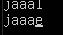

*JOE editor showing the result after text substitution is completed.*

---
## Part 8: SSH Service Installation and Configuration
The OpenSSH server was installed to enable secure remote access.

- **Installation:** The service was installed via `sudo apt-get install openssh-server`.

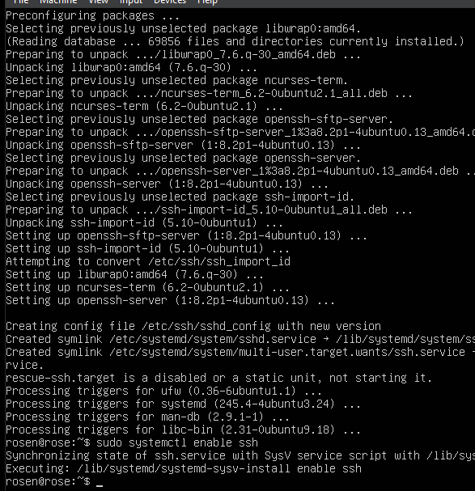

*Terminal output showing the successful installation of the `openssh-server` package.*

- **Configuration:** The SSH service was enabled to start automatically on boot. For security, the default port was changed to `2022` in the `/etc/ssh/sshd_config` file.

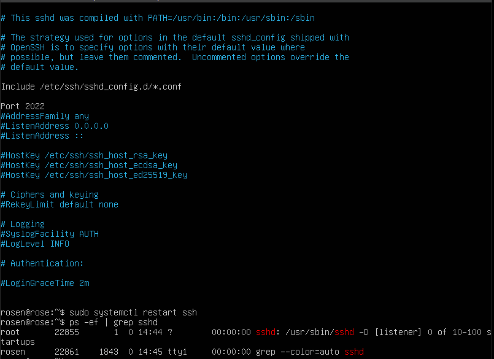

*The SSH configuration file (`sshd_config`) opened in an editor, showing the `Port` directive changed to `2022`.*

- **Verification:** The `ps aux | grep ssh` command confirmed the SSH process was running. After a reboot, `netstat -tan` was used to verify that the service was listening for connections on the configured port (`2022`).

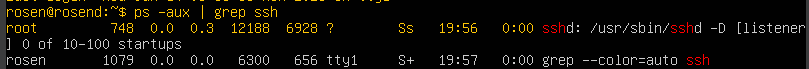

*Output of `ps aux | grep ssh` showing the SSH daemon (`sshd`) process is running.*

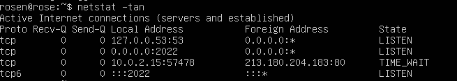

*Output of `netstat -tan` showing the SSH service is actively listening on TCP port `2022`.*

---
## Part 9: System Process Monitoring
System resource usage was analyzed using the `top` and `htop` utilities.

Working time: 12h 59m  
Users in the system: 1  
Average load: 0.00% (1m), 0.00% (5m), 0.00% (15m)  
Processes: 106  
CPU: us=0.0% (user), sy=0.0% (system), ni=0.0% (nice), id=100.0% (idle), wa=0.0% (I/O), hi=0.0% (app. interrupts), si=0.0% (progr. interrupts), st=0.0% (virtual. machines)  
Memory (MiB): total=1971.3, free=229.9, used=181.5, cache=1560.0  
Top memory: PID 836  
Top CPU: PID 822  

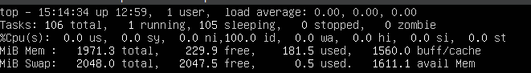

*The main `top` interface showing an overview of system resources.*

### **Sorted by PID**
Processes listed in numerical order by Process ID. Useful for tracing parent/child process relationships.

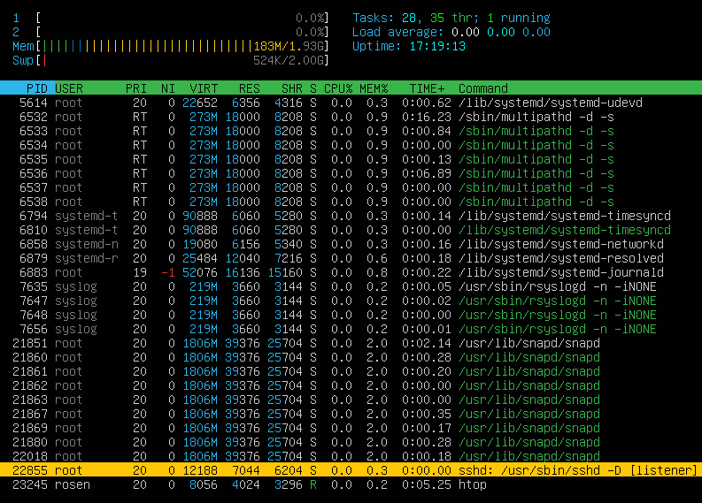

*`htop` interface with processes sorted by Process ID (PID).*

### **Sorted by PERCENT_CPU**
Processes ranked by **current CPU usage** (highest to lowest). Immediately highlights performance bottlenecks, critical for diagnosing lag or high load.

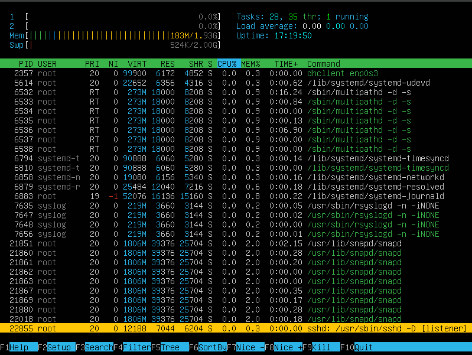

*`htop` interface with processes sorted by CPU usage percentage.*

### **Sorted by PERCENT_MEM**
Processes ranked by **RAM usage percentage** (highest to lowest). Shows which apps consume the most physical memory, helps spot memory leaks.

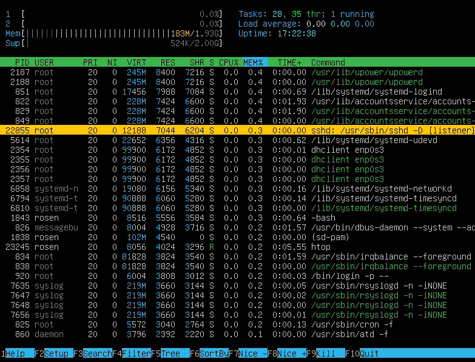

*`htop` interface with processes sorted by memory usage percentage.*

### **Sorted by TIME**
Processes ranked by **total accumulated CPU time** since launch (highest to lowest). Reveals long-running tasks, good for finding forgotten background jobs.

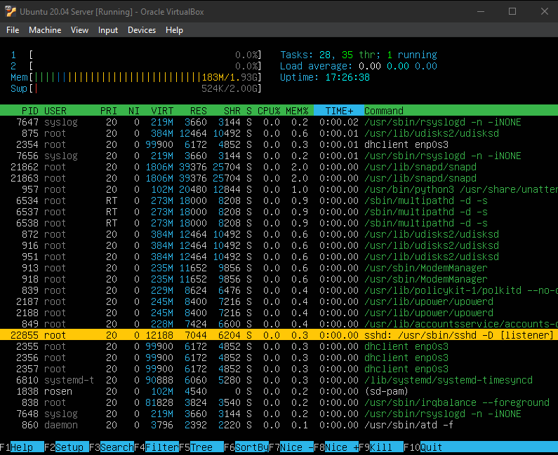

*`htop` interface with processes sorted by total accumulated CPU time.*

### **Filtered for `sshd`**
Only displays processes containing "**sshd**" in their name/command. Shows active SSH sessions and their resource usage. Essential for monitoring remote access.

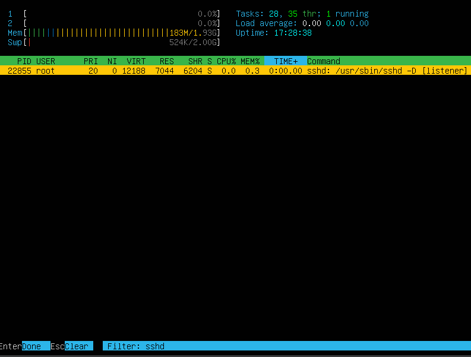

*`htop` interface filtered to show only processes containing "sshd".*

### **`syslog` process found by search**
Used `htop`'s **search function** (`/` key for me, can F3 be used). Search highlights matches without hiding other processes—ideal for pinpointing specific services.

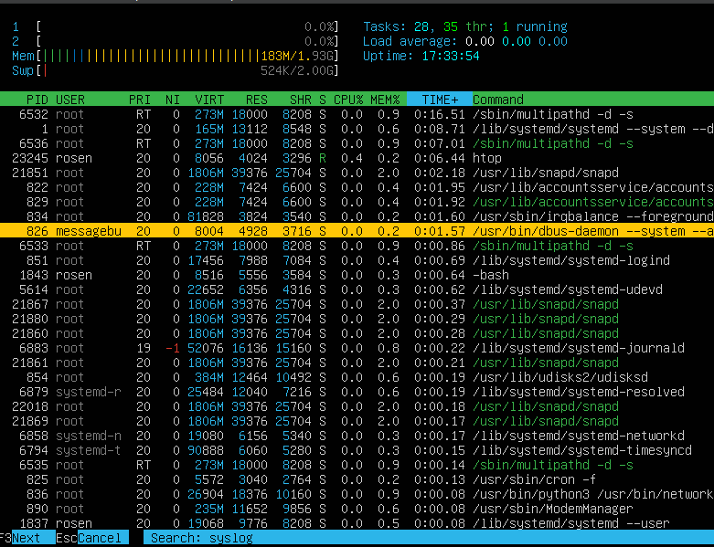

*`htop` interface using the search function to find and highlight the `syslog` process.*

### **Hostname, clock, and uptime added**
*Enable via `F2` or `Shift + S` → "Meters" → check "Hostname", "Clock", and "Uptime".*

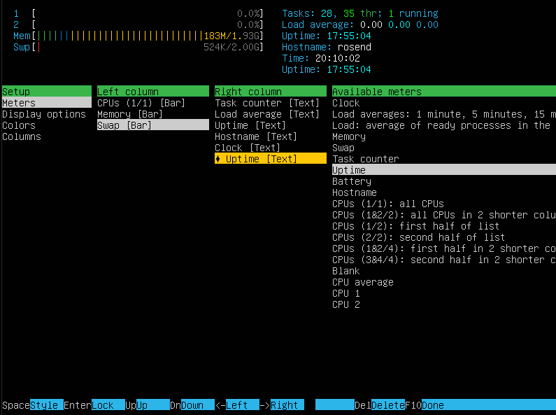

*`htop` interface with additional header meters displaying the system hostname, current clock time, and system uptime.*

---
## Part 10: Disk Partition Analysis with `fdisk`
The `fdisk -l` command was used to inspect the primary disk partitions. The analysis revealed the disk name (`/dev/sda`), total capacity (`25.0 GiB`), sector count, and the size of the swap partition (`2 GiB`).

`fdisk -l` for disk and `free -h` for swap: **dev/sda** disk, **25.0 GiB**, **52428800** sectors, **2 GiB** swap total

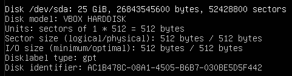

*Output of the `sudo fdisk -l` command showing disk `/dev/sda` details, including partition table and a 2 GiB swap partition.*

*Output of the `free -h` command confirming the total available swap space is 2.0 GiB.*

---
## Part 11: Filesystem Disk Space Usage with `df`
The `df` utility was used to report on filesystem disk space usage.

- `df /`: Showed the root partition's size, used space, free space, and usage percentage in kibibytes.
- `df -Th /`: Provided the same information in a human-readable format (Gigabytes) and identified the filesystem type as `ext4`.

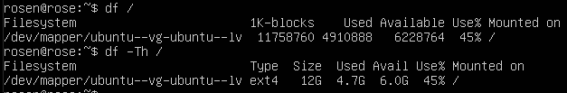

*Output of the `df -Th /` command, showing the root filesystem (`/`) is `ext4` type, with size, used, available, and percentage used in human-readable format (GB).*

---
## Part 12: Directory Space Usage with `du`
The `du` utility was employed to calculate the disk space consumed by specific directories. The sizes of `/home`, `/var`, and `/var/log` were reported first in bytes and then in a human-readable format for easier interpretation.

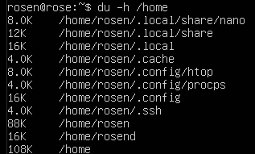

*Output of `sudo du -h /home` showing the size of the `/home` directory in bytes.*

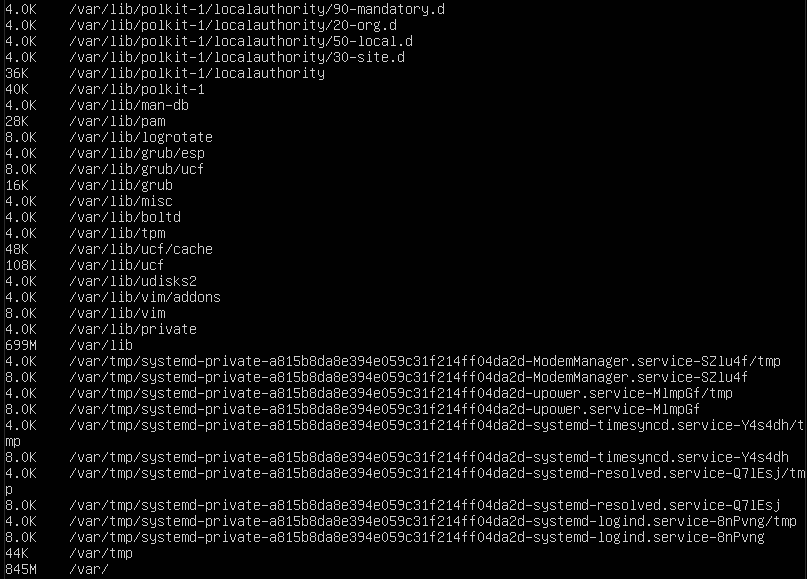

*Output of `sudo du -h /var` showing the size of the `/var` directory in bytes.*

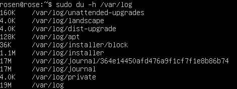

*Output of `sudo du -h /var/log` showing the size of the `/var/log` directory in bytes.*

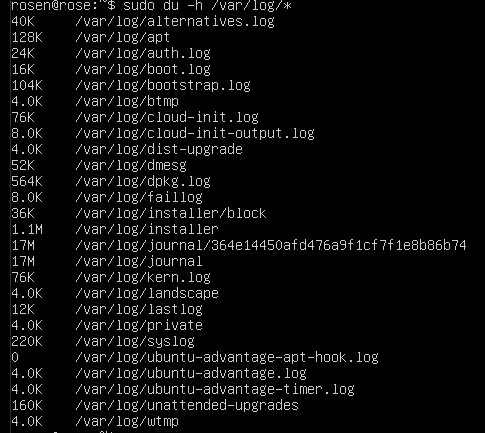

*Output of `sudo du -h /var/log -s` showing the human-readable size of the `/var/log` directory.*

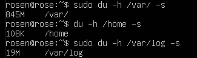

*Output of `sudo du -h /home /var /var/log -s` showing the human-readable sizes of all three target directories.*

---
## Part 13: Interactive Disk Usage Analysis with `ncdu`
The `ncdu` utility was installed to provide an interactive way to analyze disk usage. Download: `sudo apt install ncdu`. It was used to navigate and inspect the sizes of the `/home`, `/var`, and `/var/log` directories, offering a more detailed, navigable view than `du`.

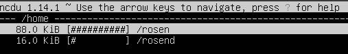

*The `ncdu` interactive interface scanning and displaying the disk usage of the `/home` directory.*

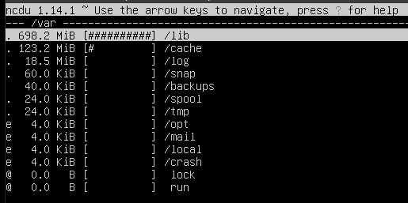

*The `ncdu` interactive interface scanning and displaying the disk usage of the `/var` directory.*

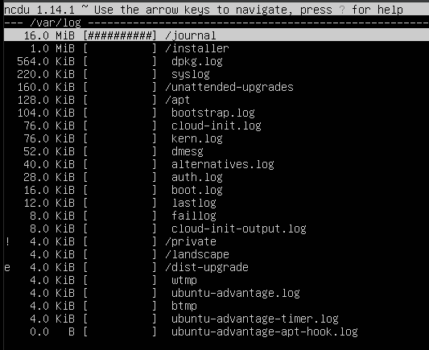

*The `ncdu` interactive interface displaying the detailed size of the `/var/log` directory.*

---
## Part 14: System Log Analysis
System logs were examined to trace system events. By reviewing `auth.log` and `syslog`, it was possible to identify the timestamp of the last successful user login and confirm the exact time the SSH service was restarted.

Last successful login time was Jan 13 21:44:

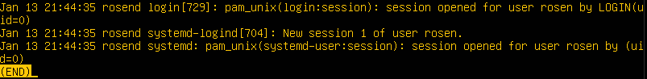

*A segment of the `/var/log/auth.log` file showing a successful SSH login event with its timestamp.*

Restarted SSHd service using `sudo systemctl restart ssh`
Checked logs to look for service restart message:

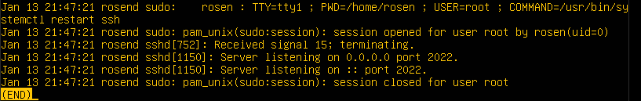

*A segment of the `/var/log/syslog` file showing a log entry for the SSH daemon (`sshd`) being restarted via systemctl.*

---
## Part 15: Task Scheduling with Cron
The CRON job scheduler was used to automate tasks.

- **Job Listing:** Current cron jobs were displayed using `crontab -l`.
- **Log Verification:** The execution of these scheduled jobs was confirmed by finding corresponding entries in `syslog`.
- **Job Removal:** All scheduled tasks for the user were removed using the `crontab -r` command.

Using the job scheduler, run the uptime command in every 2 minutes using `crontab -e`:

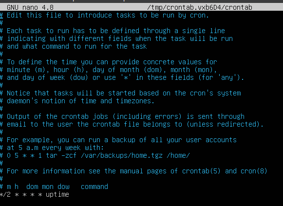

*The `crontab -e` editor open, showing a cron job configured to run the `uptime` command every two minutes.*

Display CRON job: crontab -l.

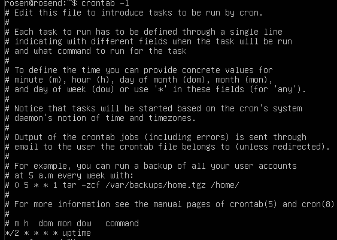

*Output of the `crontab -l` command, listing the active cron job for the user.*

`Uptime` activates every two minutes, cat /var/log/syslog.

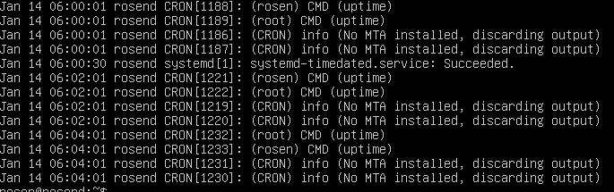

*Entries in `/var/log/syslog` showing the CRON daemon executing the scheduled `uptime` command.*

Removing crontab tasks with `crontab -r`.

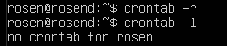

*Terminal showing the use of the `crontab -r` command to remove all cron jobs, followed by `crontab -l` confirming no jobs are present.*

---