# Network Configuration Report

## Part 1. **ipcalc** tool

- Start a virtual machine (hereafter -- ws1)

  

### 1.1. Networks and Masks

- Define and write in the report:

  - 1) network address of _192.167.38.54/13_

    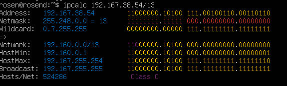

  - 2) conversion of the mask _255.255.255.0_ to prefix and binary, _/15_ to normal and binary, _11111111.11111111.11111111.11110000_ to normal and prefix

    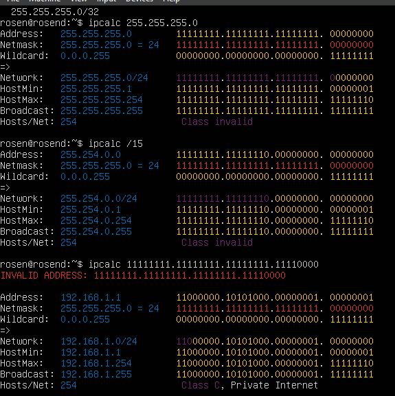

    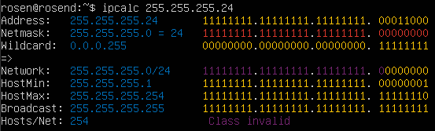

  - 3) minimum and maximum host in _12.167.38.4_ network with masks: _/8_, _11111111.11111111.00000000.00000000_, _255.255.254.0_ and _/4_

    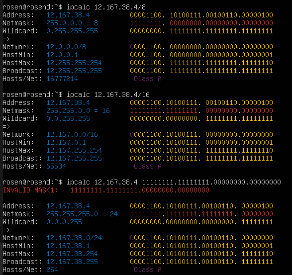

    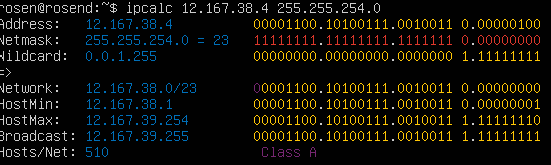

    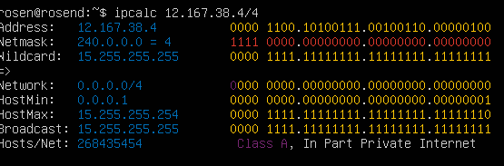

### 1.2. localhost

- Determine whether an application running on localhost can be accessed with the given IPs:

  - **194.34.23.100**: No – Public IP, not loopback. Application bound to localhost won't receive connections.
  - **127.0.0.2**: Yes – Within loopback range (127.0.0.0/8). All addresses in that range route back to localhost.
  - **127.1.0.1**: Yes – Also within loopback range (127.0.0.0/8).
  - **128.0.0.1**: No – Outside loopback range, requires network routing.

- Verification using `ping -c 2`:

  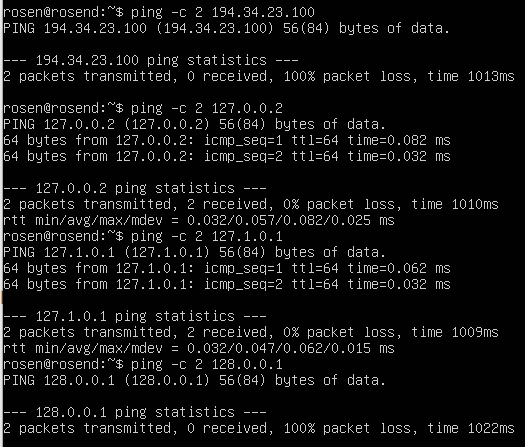

### 1.3. Network ranges and segments

- 1) Which of the listed IPs can be used as public and which only as private:

  **Private IP Address Ranges:**
  - **10.0.0.0/8** – all addresses starting with 10 (10.0.0.0 – 10.255.255.255)
  - **172.16.0.0/12** – addresses starting with 172 and second octet 16–31 (172.16.0.0 – 172.31.255.255)
  - **192.168.0.0/16** – addresses starting with 192.168 (192.168.0.0 – 192.168.255.255)

  **Special non-public ranges:** loopback (127.0.0.0/8), APIPA (169.254.0.0/16), multicast (224.0.0.0/4), reserved (240.0.0.0/4), “this network” (0.0.0.0/8). Everything else is public.

  - **10.0.0.45** – Private (starts with 10)
  - **134.43.0.2** – Public (not in private ranges)
  - **192.168.4.2** – Private (starts with 192.168)
  - **172.20.250.4** – Private (172.20 is within 172.16/12)
  - **172.0.2.1** – Public (172.0 is outside 172.16/12)
  - **192.172.0.1** – Public (192.172 is not 192.168)
  - **172.68.0.2** – Public (172.68 is outside 172.16/12)
  - **172.16.255.255** – Private (172.16 is within 172.16/12)
  - **10.10.10.10** – Private (starts with 10)
  - **192.169.168.1** – Public (192.169 is not 192.168)

  - First two tests with `ipcalc`:

    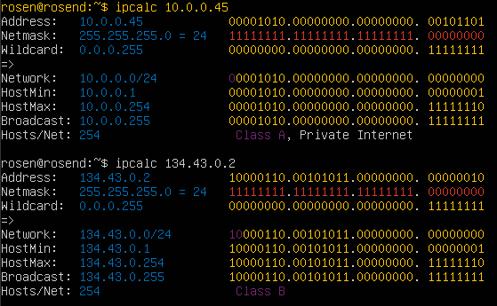

- 2) Which of the listed gateway IP addresses are possible for _10.10.0.0/18_ network:  
  _10.0.0.1_, _10.10.0.2_, _10.10.10.10_, _10.10.100.1_, _10.10.1.255_

  Requirements:
  - Must start with **10.10** (first two octets)
  - Third octet must be between **0 and 63**
  - Cannot be network address (10.10.0.0) or broadcast (10.10.63.255)
  - Must be within 10.10.0.1 – 10.10.63.254

  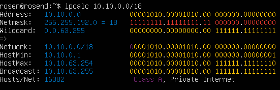

  **Possible:** 10.10.0.2, 10.10.10.10, 10.10.1.255

## Part 2. Static routing between two machines

- Start two virtual machines (hereafter -- ws1 and ws2)

  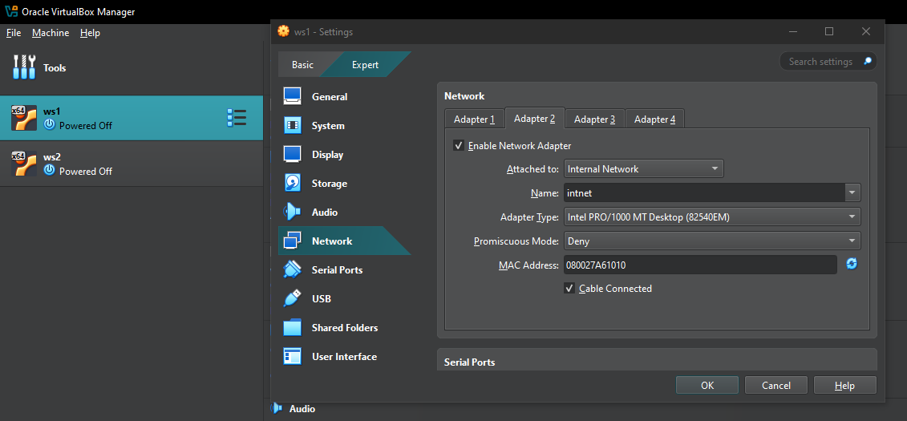

- View existing network interfaces with the `ip a` command:

  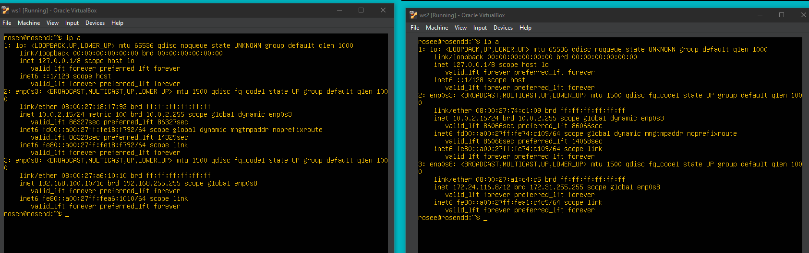

- Describe the network interface corresponding to the internal network on both machines and set the following addresses and masks:  
  ws1 — _192.168.100.10_, mask _/16_  
  ws2 — _172.24.116.8_, mask _/12_

  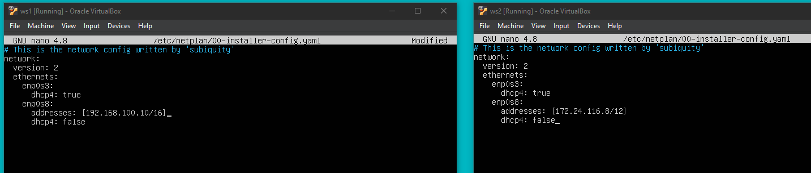

### 2.1. Adding a static route manually

- Add a static route from one machine to another and back using `ip r add` command.
- Ping the connection between the machines.

  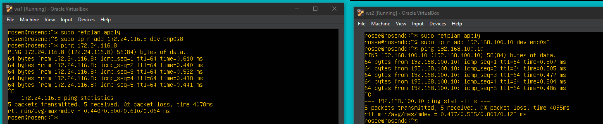

### 2.2. Adding a static route with saving

- Restart the machines.
- Add static route from one machine to another using _/etc/netplan/00-installer-config.yaml_ file.

  - Screenshot of the changed file on ws1:

       <!-- Note: same image used for both? Original had duplicate. Keep as is. -->

  - Screenshot of the changed file on ws2:

    

- Run `netplan apply` to restart the network service.

    
  *(All steps combined in one screenshot)*

## Part 3. **iperf3** utility

### 3.1. Connection speed

- Convert and write results in the report:
  - 8 Mbps = 1 MB/s
  - 100 MB/s = 819200 Kbps
  - 1 Gbps = 1024 Mbps

### 3.2. **iperf3** utility

- Measure connection speed between ws1 and ws2:

  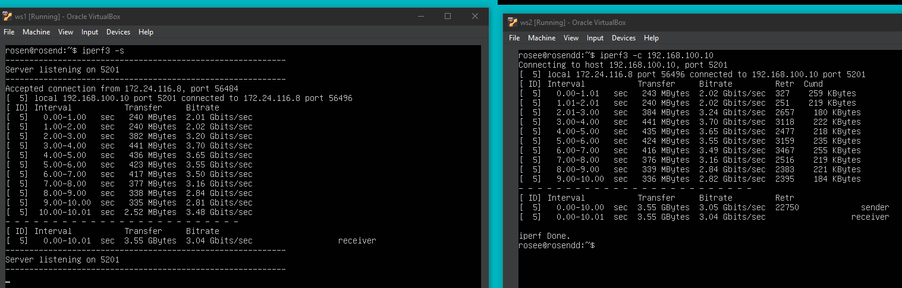

## Part 4. Network firewall

### 4.1. **iptables** utility

- On ws1 apply a strategy where a deny rule is written at the beginning and an allow rule at the end.
- On ws2 apply a strategy where an allow rule is written at the beginning and a deny rule at the end.
- Open access on machines for port 22 (ssh) and port 80 (http).
- Reject _echo reply_ (machine must not ping, i.e., lock on OUTPUT).
- Allow _echo reply_ (machine must be pinged).

- Create a _/etc/firewall.sh_ file simulating the firewall on ws1 and ws2:

  - **Machine ws1: `/etc/firewall.sh` (Deny-First Strategy)**
  - **Machine ws2: `/etc/firewall.sh` (Allow-First Strategy)**

    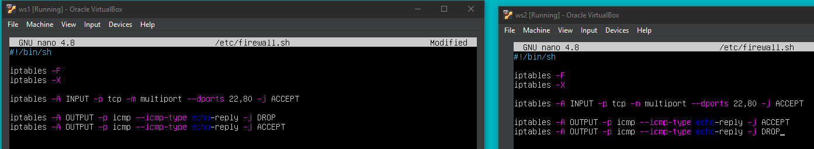

- Check rules with `iptables -L -n -v`:

  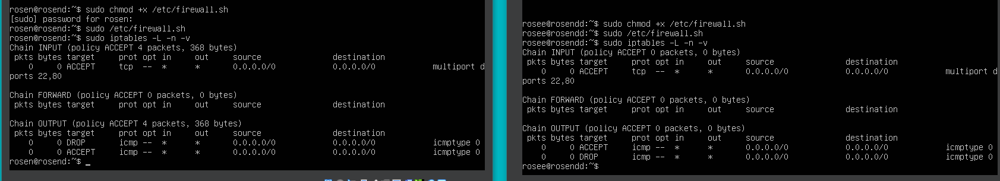

### 4.2. **nmap** utility

- Use **ping** command to find a machine which is not pinged, then use **nmap** utility to show that the machine host is up (nmap output should say `Host is up`).

  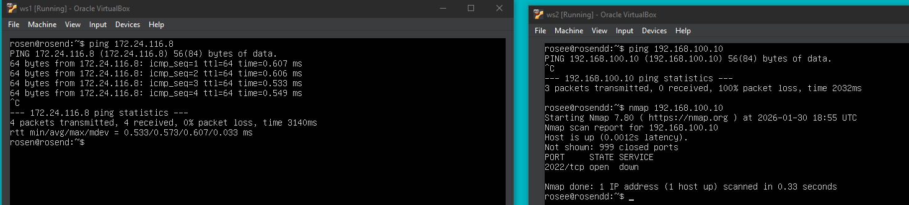

- Save dumps of the virtual machine images:

  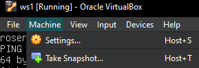

  

## Part 5. Static network routing

- Set up the machine configurations in _/etc/netplan/00-installer-config.yaml_ according to the network in the picture (ws11, ws22, ws21, r1, r2).

  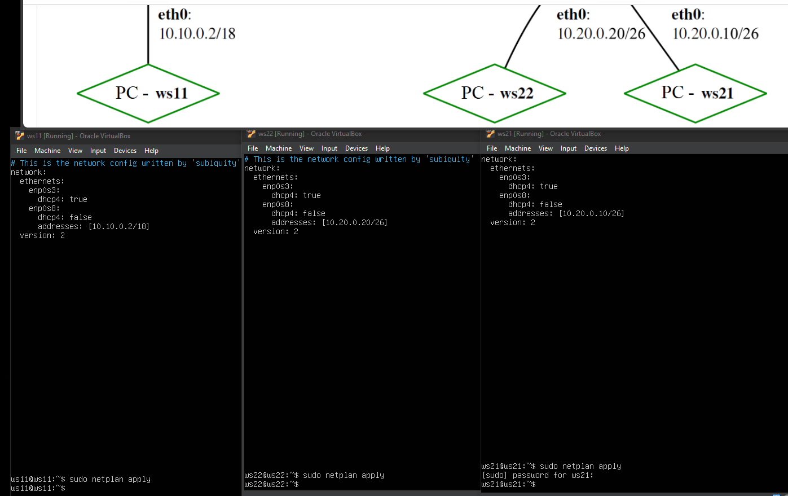

  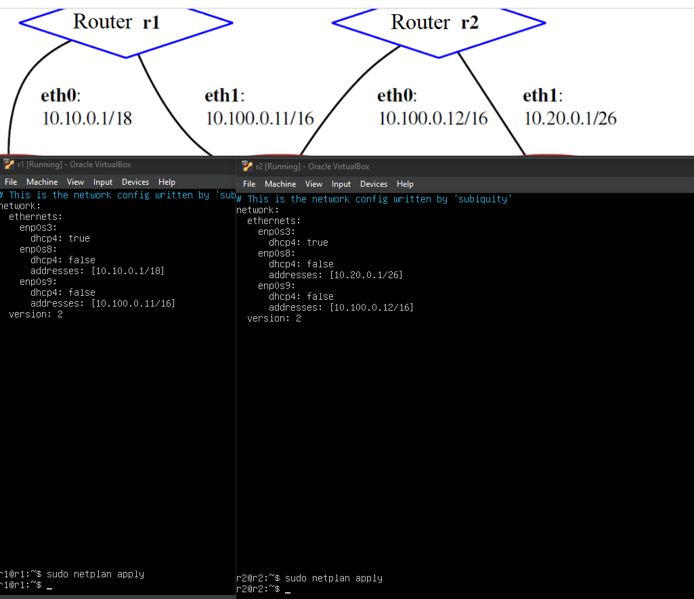

- Restart the network service. Check addresses with `ip -4 a`. Also ping ws22 from ws21, and ping r1 from ws11.

  **ip -4 a outputs:**

  - r1:

    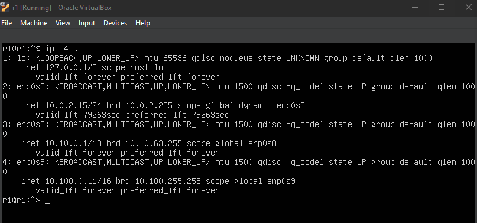

  - r2:

    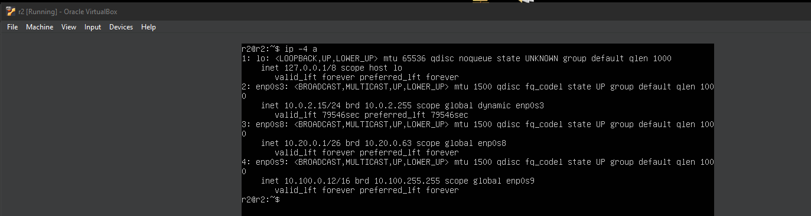

  - ws11:

    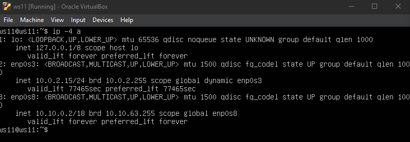

  - ws22:

    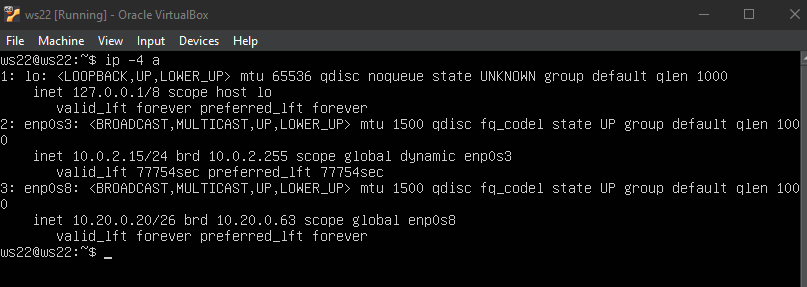

  - ws21:

    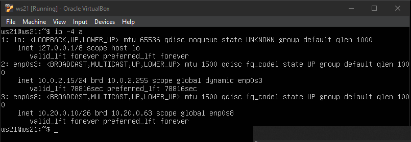

- Ping ws22 from ws21:

  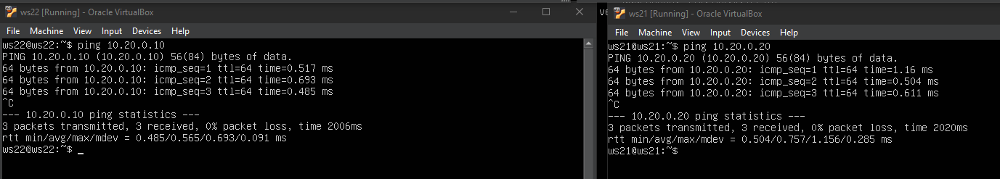

- Ping r1 from ws11:

  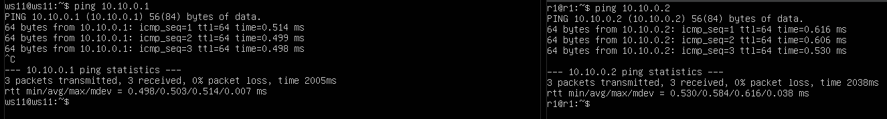

### 5.2. Enabling IP forwarding

- On the routers, run:  
  `sysctl -w net.ipv4.ip_forward=1`

  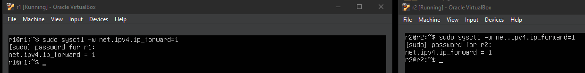

- Open _/etc/sysctl.conf_ and add line `net.ipv4.ip_forward = 1` for permanent enabling.

  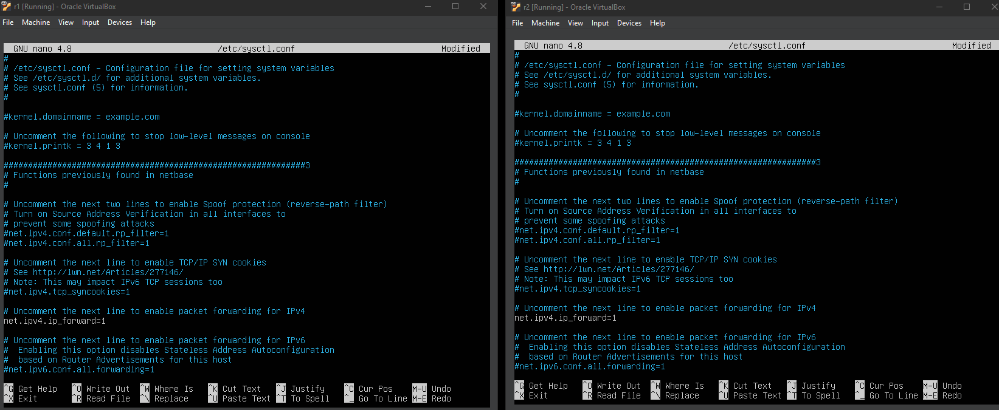

### 5.3. Default route configuration

- Configure default route (gateway) for the workstations by adding `default` before the router's IP in the netplan config (all 5 VMs).

  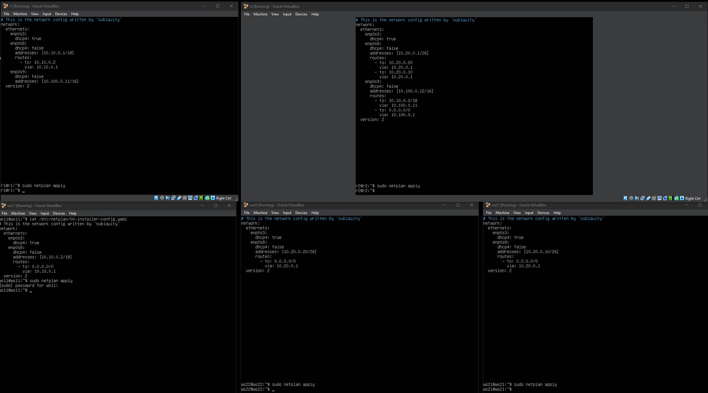

- Call `ip r` to show the added route:

  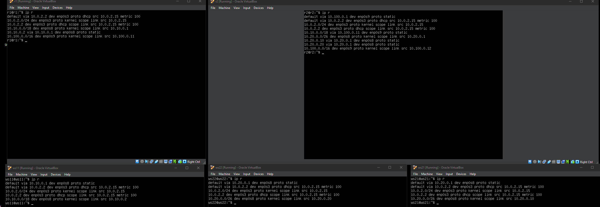

- Ping r2 router from ws11 and show on r2 that the ping is reaching using `tcpdump -tn -i eth0`:

  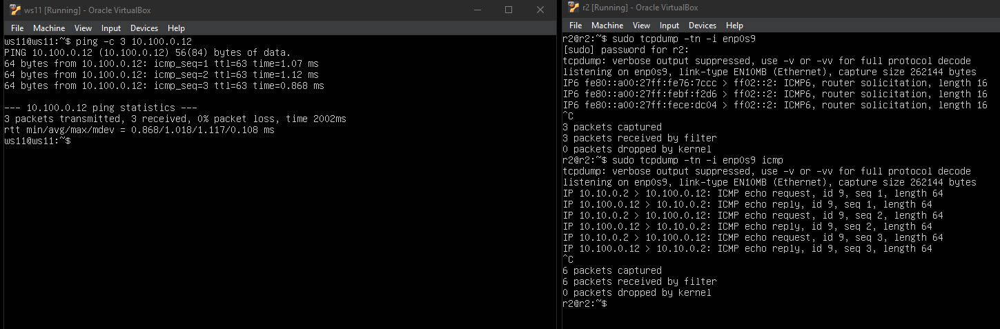

### 5.4. Adding static routes

- Add static routes to r1 and r2 in configuration file. Example for r1 route to 10.20.0.0/26:

  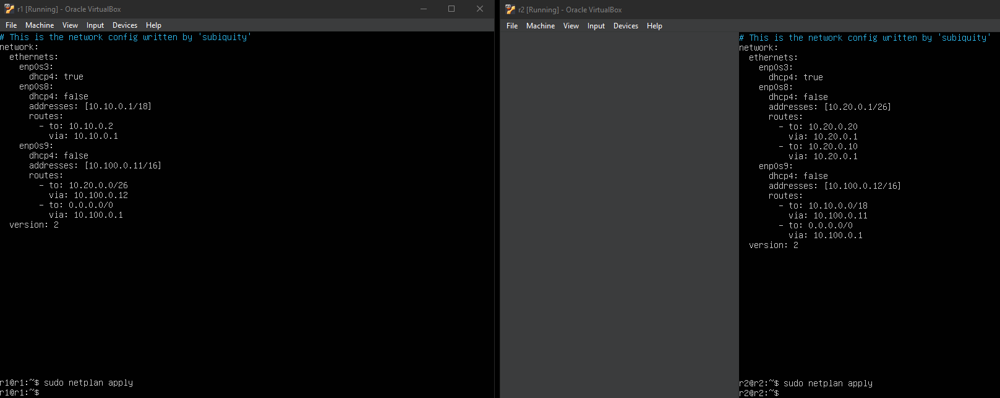

- Call `ip r` and show route tables on both routers. Example r1 table:

  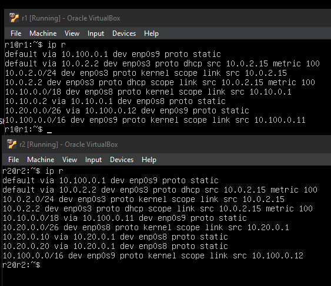

- Run `ip r list 10.10.0.0/18` and `ip r list 0.0.0.0/0` on ws11:

  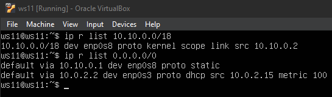

- **Explanation:**  
  The command `ip r list 10.10.0.0/18` shows a specific route for that network:  
  `10.10.0.0/18 dev enp0s8 proto kernel scope link src 10.10.0.2`  
  - `dev enp0s8` → traffic goes through interface enp0s8  
  - `proto kernel` → route added automatically by kernel  
  - `scope link` → valid only in local link  
  - `src 10.10.0.2` → source IP used  

  The command `ip r list 0.0.0.0/0` shows the default route:  
  `default via 10.10.0.1 dev enp0s8`  

  The system always chooses the most specific route (longest prefix match). For network 10.10.0.0/18, the /18 route is more specific than /0, so packets are delivered directly within the subnet without going through the gateway.

### 5.5. Making a router list

- Run `tcpdump -tnv -i eth0` on r1.
- Use **traceroute** from ws11 to ws21 to list routers in the path:

  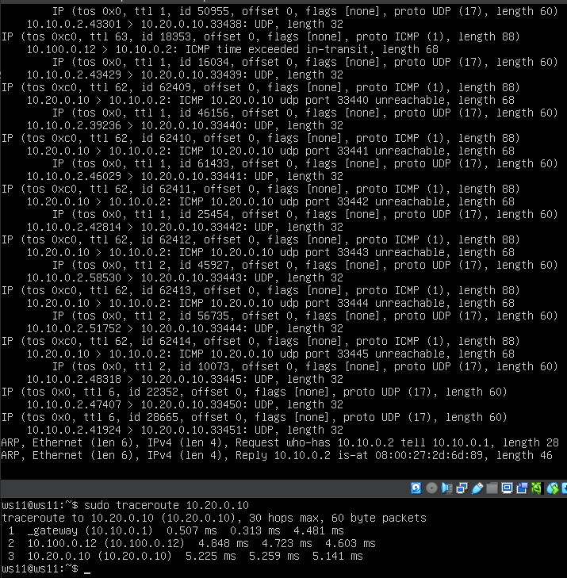

  The path is built hop by hop until the destination is reached. Each packet passes through a certain number of nodes, and each node increments a counter tracking the number of hops.

### 5.6. Using **ICMP** protocol in routing

- On r1, capture traffic on eth0 with:  
  `tcpdump -n -i eth0 icmp`
- From ws11, ping a non-existent IP (e.g., 10.30.0.111):  
  `ping -c 1 10.30.0.111`

  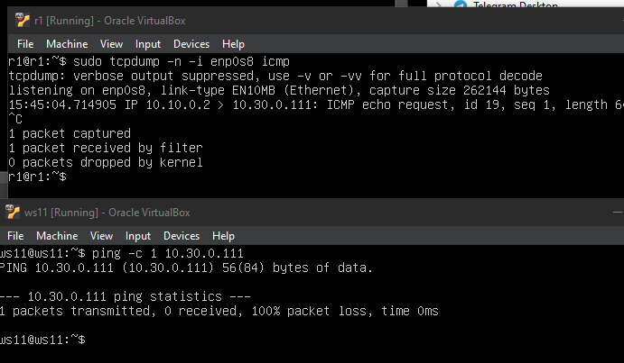

## Part 6. Dynamic IP configuration using **DHCP**

- For r2, configure the **DHCP** service in _/etc/dhcp/dhcpd.conf_:
  - Specify default router address, DNS-server, and internal network address. Example for r2:

    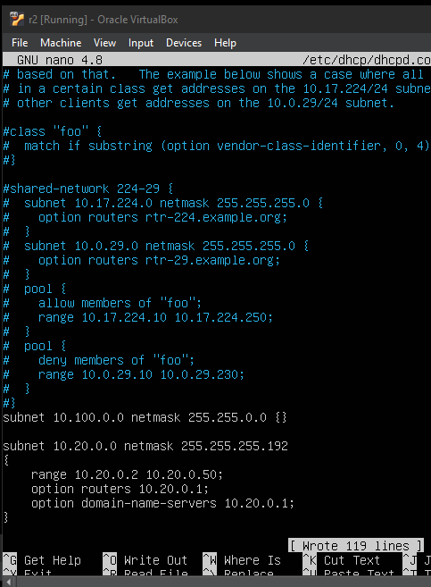

  - Write `nameserver 8.8.8.8` in _/etc/resolv.conf_:

    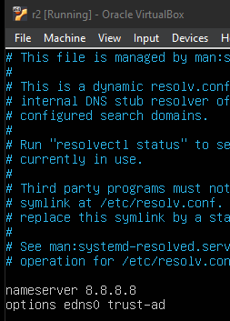

- Restart DHCP service: `systemctl restart isc-dhcp-server`.

  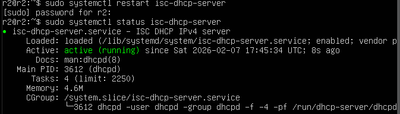

- Reboot ws21 (`reboot`) and show with `ip a` that it got an address. Also ping ws22 from ws21.

  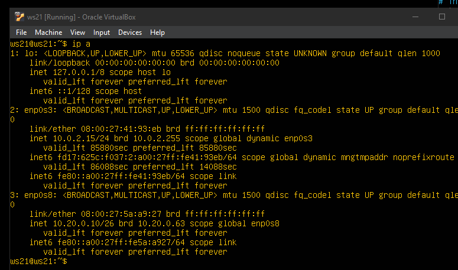  
  *(Note: IP not assigned if netplan was set to not use DHCP; after proper configuration it should get an address.)*

  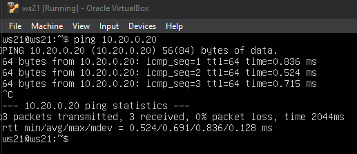

- Specify MAC address at ws11 by adding to _/etc/netplan/00-installer-config.yaml_:  
  `macaddress: 10:10:10:10:10:BA`, `dhcp4: true`

  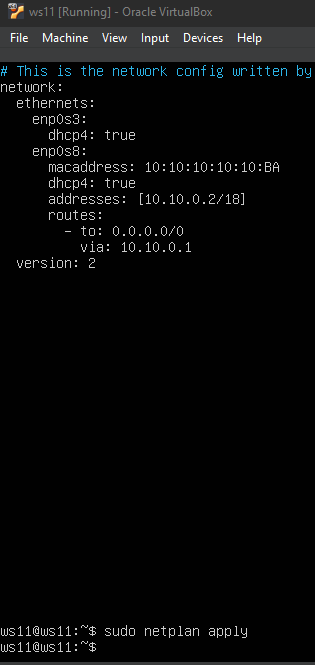

- Configure r1 similarly, but make address assignment strictly linked to MAC address (ws11).

  - Edit `/etc/dhcp/dhcpd.conf`:

    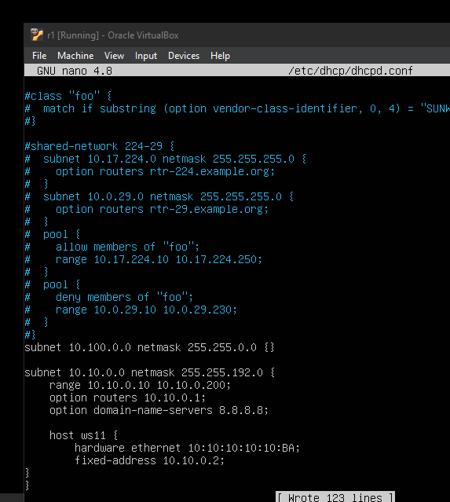

  - Add `nameserver 8.8.8.8` in `/etc/resolv.conf`:

    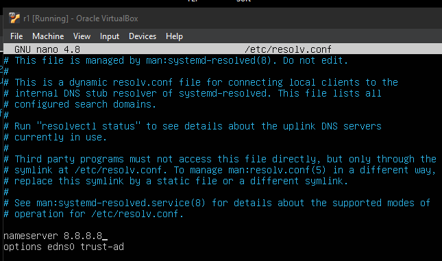

  - Restart DHCP service: `systemctl restart isc-dhcp-server`

    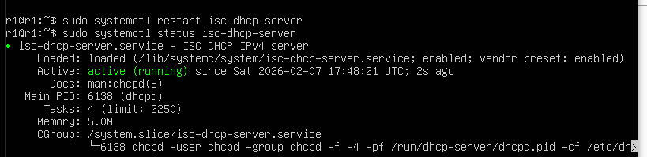

- Run the same tests:

  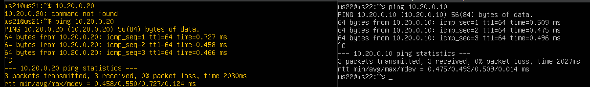

- Request IP address update from ws21 (before and after):

  - Before:

    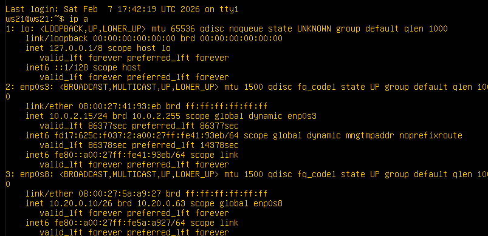

  - After releasing and renewing:  
    `sudo dhclient -r enp0s8` (release)  
    `sudo dhclient enp0s8` (acquire new)

    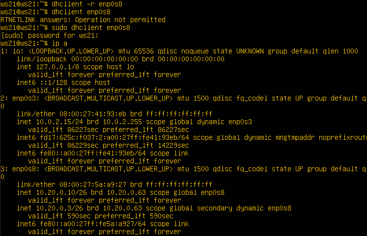

## Part 7. **NAT**

- In _/etc/apache2/ports.conf_ change `Listen 80` to `Listen 0.0.0.0:80` on ws22 and r1 to make Apache public.

  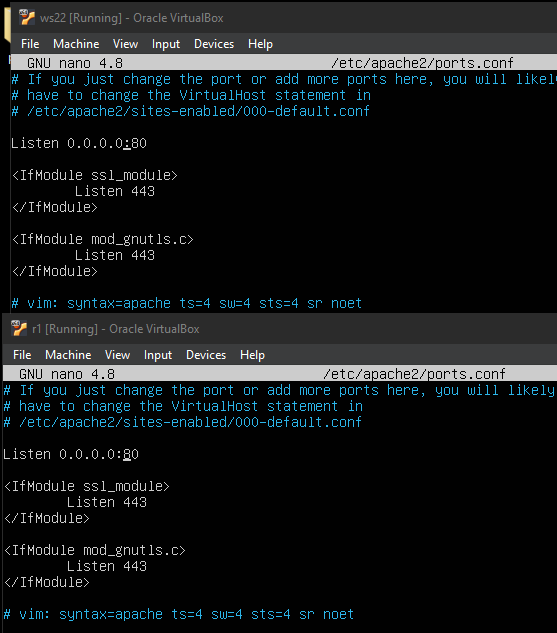

- Start Apache: `service apache2 start`

  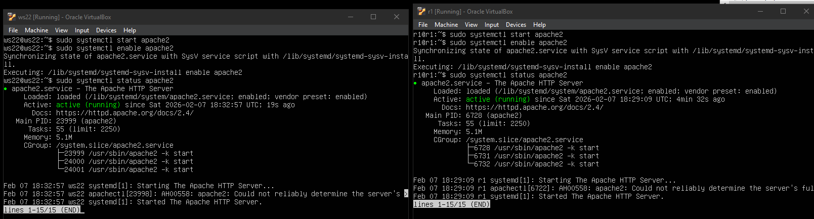

- Add the following rules to the firewall script on r2 (similar to Part 4):
  1. Delete rules in filter table: `iptables -F`
  2. Delete rules in NAT table: `iptables -F -t nat`
  3. Drop all routed packets: `iptables --policy FORWARD DROP`

     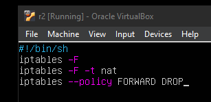

- Make script executable and run: `chmod +x /etc/firewall.sh && sudo /etc/firewall.sh`

  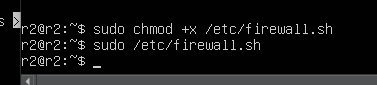

- Check connection between ws22 and r1 with `ping` (should fail initially):

  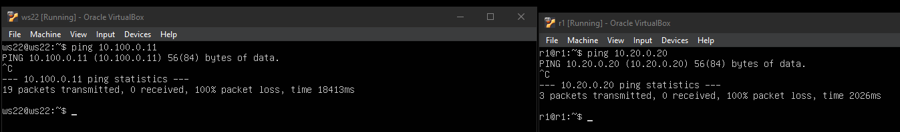

- Add another rule to allow routing of all **ICMP** protocol packets:

  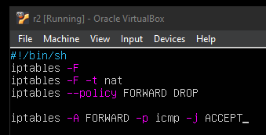

- Run the script again and check ping (should succeed):

  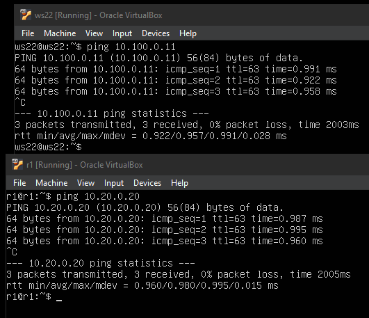

  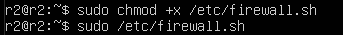

- Enable **SNAT** to masquerade all local IPs from the local network behind r2 (network 10.20.0.0/26).
- Enable **DNAT** on port 8080 of r2 to forward to Apache on ws22 (port 80).

  Add the following rules to the firewall script:

  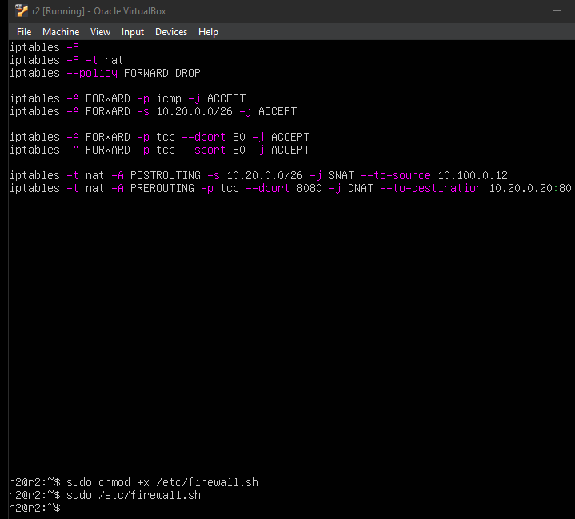

  **Explanation:**
  - SNAT changes source address/port (POSTROUTING chain).
  - DNAT changes destination address/port (PREROUTING chain).
  - FORWARD rules allow HTTP traffic and related/established connections.

- Check **SNAT** by connecting from ws22 to Apache on r1 using `telnet <r1_ip> 80`:

  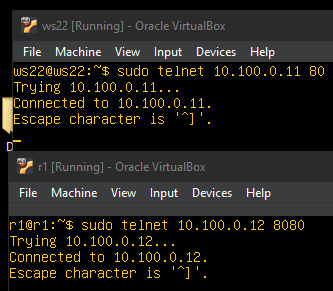

- Check **DNAT** by connecting from r1 to Apache on ws22 via r2 on port 8080 using `telnet 10.100.0.12 8080`:

  

## Part 8. Bonus. Introduction to **SSH Tunnels**

- Run the firewall on r2 with the rules from Part 7:

  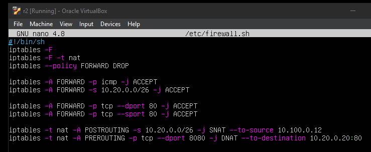

- Start Apache on ws22 on localhost only (change `/etc/apache2/ports.conf` to `Listen localhost:80`):

  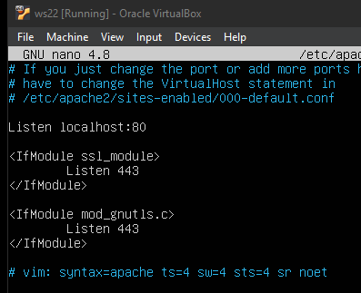

- Ensure SSH server is running: `sudo systemctl status ssh`

  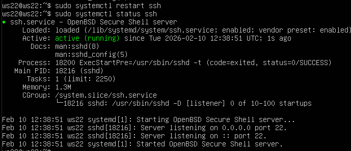

- Use **Local TCP forwarding** from ws21 to ws22 to access the web server on ws22 from ws21:

  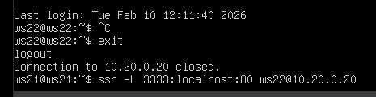

  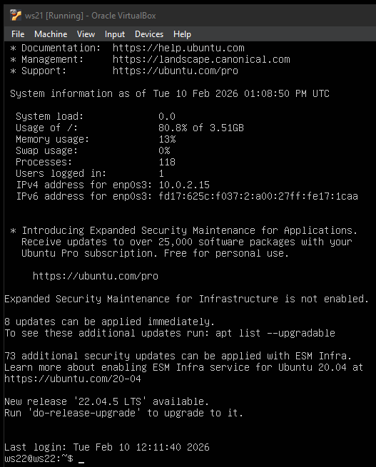

- From another terminal on ws21, test with `telnet 127.0.0.1 3333`:

  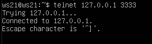

- Use **Remote TCP forwarding** from ws11 to ws22 to access the web server on ws22 from ws11:

  

  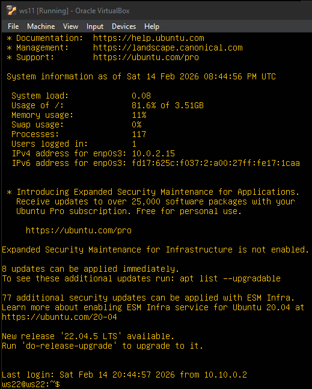

- From another terminal on ws11, test with `telnet 127.0.0.1 8080`:

  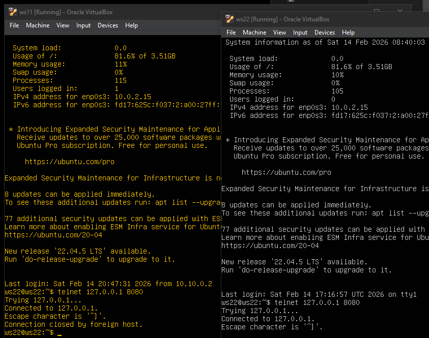

  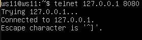